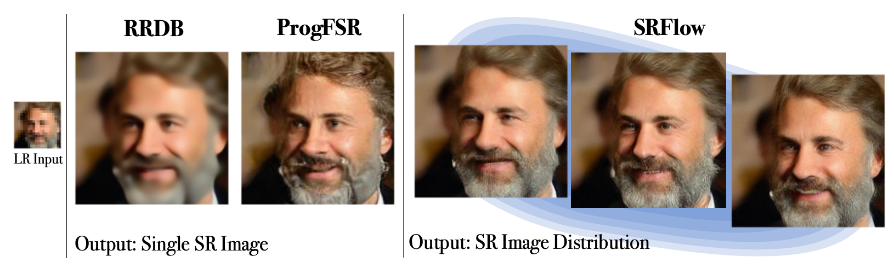

# SRFlow
## Learning the Super-Resolution Space with Normalizing Flow <br> <sub> [[Paper] ECCV 2020 Spotlight](https://bit.ly/2DkwQcg) </sub>
<br><br>

[](https://bit.ly/3jWFRcr)
<br><br>

**Our paper explains:**

- **How to train Conditional Normalizing Flow** <br>
  We designed an architecture that archives state-of-the-art super-resolution quality.
- **How to train Normalizing Flow on a single GPU**  <br>
  We based our network on GLOW, which uses up to 40 GPUs to train for image generation. SRFlow only needs a single GPU for training conditional image generation.
- **How to use Normalizing Flow for image manipulation**  <br>
  How to exploit the latent space for Normalizing Flow for controlled image manipulations
- **See many Visual Results**  <br>
  Compare GAN vs Normalizing Flow yourself. We've included a lot of visuals results in our [[Paper]](https://bit.ly/2D9cN0L).

# Why I stopped using GAN - Blog

[](https://bit.ly/2EdJzhy)

- **Sampling:** SRFlow outputs many different images for a single input.
- **Stable Training:** SRFlow has much fewer hyperparameters than GAN approaches, and we did not encounter training stability issues.
- **Convergence:** While GANs cannot converge, conditional Normalizing Flows converge monotonic and stable.
- **Higher Consistency:** When downsampling the super-resolution, one obtains almost the exact input.

Get a quick introductrion to Normalizing Flow in our [[Blog]](https://bit.ly/320bAkH).
<br><br><br>

# Paper
[[Paper] ECCV 2020 Spotlight](https://bit.ly/2XcmSks)

```bibtex
@inproceedings{lugmayr2020srflow,
  title={SRFlow: Learning the Super-Resolution Space with Normalizing Flow},
  author={Lugmayr, Andreas and Danelljan, Martin and Van Gool, Luc and Timofte, Radu},
  booktitle={ECCV},
  year={2020}
}
```
<br><br>

# Code
- Due to our funding agreement we have to go through a legal process to publish the code.
- SRFlow is based on GLOW and and trained on a single GPU.
